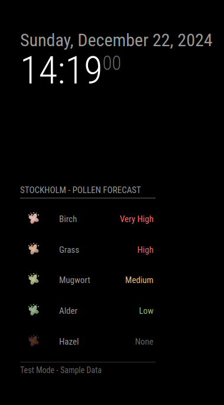

# MMM-PollenSwe

## Overview
MMM-PollenSwe is a MagicMirror² module designed to display pollen forecasts for regions in Sweden. It fetches data from the **Swedish Museum of Natural History's Pollen API** and provides an intuitive view of pollen levels across various types.

### Note
This module is under **development** and currently includes functionality to display pollen forecasts. Work is ongoing to translate elements into Swedish.



## Features
- Displays pollen levels for different regions in Sweden.
- Includes icons to visually represent pollen levels.
- Supports configuration for custom regions and display preferences.

## Installation
1. Clone the repository into your MagicMirror modules folder:
   ```bash
   cd ~/MagicMirror/modules
   git clone https://github.com/cgillinger/MMM-PollenSwe.git
   ```
2. Navigate into the module directory and install dependencies:
   ```bash
   cd MMM-PollenSwe
   npm install
   ```

## Configuration
Add the following configuration block to the `config.js` file of your MagicMirror installation:

```javascript
{
  module: "MMM-PollenSwe",
  position: "top_right", // Choose your preferred position
  config: {
    region: "Stockholm", // Specify region name
    updateInterval: 3600000, // Update every hour
    showIcon: true, // Show icons for pollen levels
    maxPollensShown: 5 // Number of pollen types to display
  }
}
```

### Adding Other Regions
To add other regions (orter):
1. Locate your desired region using the [API's `/regions` endpoint](https://api.pollenrapporten.se/v1/regions).
2. Update the `region` configuration option with the region name.

### Default Configuration Options
| Option             | Description                                                                                 | Default           |
|--------------------|---------------------------------------------------------------------------------------------|-------------------|
| `region`           | Name of the region to display pollen data for.                                              | `Stockholm`       |
| `updateInterval`   | Time in milliseconds between updates.                                                       | `3600000` (1 hr)  |
| `showIcon`         | Whether to display icons representing pollen levels.                                        | `true`            |
| `maxPollensShown`  | Maximum number of pollen types to display.                                                  | `5`               |
| `autoHide`         | Automatically hide the module if no data is available.                                      | `false`           |

## Usage
- The module fetches the latest data from the API and displays it in a table format.
- Use the `testMode` option for testing the module with predefined data.

## Credits
- **API**: Data provided by [Swedish Museum of Natural History's Pollen API](https://api.pollenrapporten.se/docs).
- **Icons**: Weather icons from [Meteocons Weather Icons](https://iconduck.com/sets/meteocons-weather-icons), licensed under [MIT License](https://opensource.org/licenses/MIT).

## License
This module is licensed under the [MIT License](https://opensource.org/licenses/MIT).

---

**For issues or contributions**, visit the [GitHub repository](https://github.com/cgillinger/MMM-PollenSwe).
